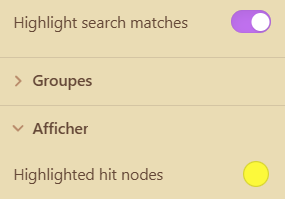

# Cluddle Graphs

Cluddle Graphs adds a highlight mode to Obsidian's graph view search. It is designed for large vaults where the default graph search can be too destructive because non-matching nodes disappear from the graph.



## Features

- **Highlight search matches**: Adds a toggle to the bottom of the graph view **Filters** section. When enabled, search matches stay visible in the full graph instead of cutting away non-matching nodes.
- **Hover-like graph emphasis**: Matching nodes are emphasized with the same relationship-focused behavior as hovering a node: matched nodes are brought forward, connected links stay visible, and unrelated graph content remains de-emphasized.
- **Positive hit color**: Adds a **Highlighted hit nodes** color picker to the graph view **Display** section. This controls the fill color for nodes that directly match the graph search.
- **Default mode preserved**: Turn **Highlight search matches** off to return to Obsidian's default graph search behavior.
- **Reset confirmation**: Adds a confirmation step to the graph settings reset button so graph filters, groups, display options, and forces are not reset accidentally.
- **Local graph depth**: Keeps local graph depth at `2` for local graph panes.

## Usage

1. Open Obsidian's graph view or local graph view.
2. Open the graph settings panel.
3. In **Filters**, enter a search query.
4. Turn on **Highlight search matches** at the bottom of the **Filters** section.
5. In **Display**, use **Highlighted hit nodes** to pick the color used for direct search hits.

When highlight mode is enabled, the search query still uses Obsidian's graph search parser. Existing graph group queries and colors continue to work. Search terms that match files are highlighted while the rest of the graph remains present for context.

## Reset confirmation

The graph reset icon now requires a second click on an **Are you sure?** button. Confirming runs the same reset sequence as Obsidian's native reset control:

- Filter options are reset.
- Graph color groups are cleared.
- Display options are reset.
- Force options are reset.

If the confirmation is not clicked, it disappears after a short delay and no reset is applied.

## Scope

This plugin only changes Obsidian graph and local graph views. It does not change canvas behavior, note files, links, metadata, or search results outside the graph panel.

## Privacy

Cluddle Graphs does not collect analytics, make network requests, or send vault data anywhere. All graph matching and highlighting runs locally inside Obsidian.

## Compatibility notes

Obsidian does not currently expose a public API for changing graph search rendering behavior. To provide hover-like highlighting without hiding non-matching nodes, this plugin uses a small, isolated compatibility layer around Obsidian's graph view objects. The implementation is intentionally scoped to open graph views, guarded with feature checks, and restored when the plugin unloads.

Cluddle Graphs is currently marked desktop-only. It does not use Node.js or Electron runtime APIs, but the graph rendering compatibility layer has not been verified against Obsidian mobile graph behavior. Mobile support should only be enabled after explicit mobile testing.

## Installation for development

Clone or copy this repository into your vault's plugin folder:

```bash
.obsidian/plugins/cluddlegraphs
```

Then enable **Cluddle Graphs** from **Settings -> Community plugins**.

## Release checklist

Before submitting to the Obsidian Community directory:

1. Commit `README.md`, `LICENSE`, `manifest.json`, and the release assets.
2. Confirm `manifest.json` has the intended `id`, `name`, `version`, `minAppVersion`, `description`, `author`, and `isDesktopOnly` values.
3. Run `npm run check`.
4. Create a GitHub release whose tag exactly matches `manifest.json` version, for example `1.5.0`.
5. Upload `main.js` and `manifest.json` as release assets. Upload `styles.css` only if one is added later.
6. Submit the GitHub repository URL through the Obsidian Community directory.

## License

MIT
